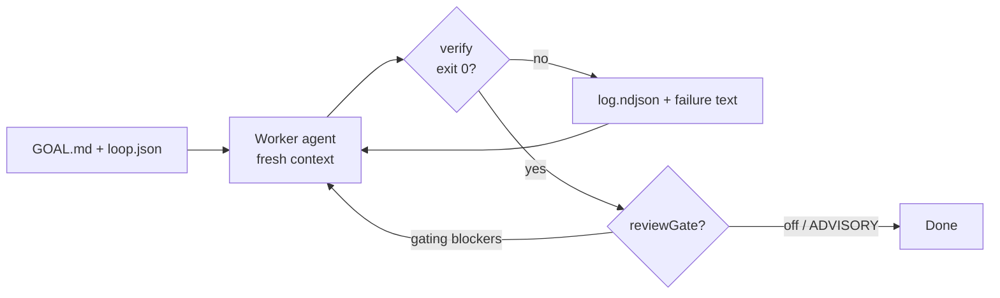

---
tags:
  - documentation
  - getting-started
  - agents
  - loops
---
# agent-loop — a loop harness that actually finishes the job

**Fix-until-green for Cursor (and Cline):** one frozen goal, a cheap worker that edits the repo, a shell check that decides “done,” optional smarter review that can send the worker back — until the check is green or you stop it.

Software is becoming a hierarchy of loops. The highest-value human work is **deciding which loops to create** — writing a measurable `GOAL.md` + `verify.sh`. The harness owns the grind; you own the finish line. (Models will keep changing; this system compounds across them.)

If you’ve heard “stop prompting, start looping” and you’re hunting GitHub for a non-theater implementation — this is that: **small, measurable, opt-in complexity**, default path is Cursor-only and relatively cheap.

> Full reference (every flag, threat model, consumer wiring): [`README.md`](./README.md)  
> Deep dive: [`ARCHITECTURE.md`](./ARCHITECTURE.md)  
> Before a tricky loop: [`docs/unknowns-preflight.md`](./docs/unknowns-preflight.md)

---

## Why this exists

A single chat agent will often:

1. Edit a few files  
2. Say “done”  
3. Leave tests red  

You are still the loop — you re-prompt, paste failures, hope.

**agent-loop** makes the computer own that cycle:

```text
GOAL (frozen) → WORKER edits code → VERIFY (shell exit 0?) → if fail, new fresh worker with the failure → repeat
```

Optional after green verify: a **judge** reviews quality. With `reviewGate`, only serious findings reopen the fix loop. Cosmetic nits don’t thrash forever.

That’s the product. Everything else is cost control and false-positive control around that spine.

---

## Why open

Agents collapsed the cost of personalizing tools: start from source, keep a rebase loop, bend the harness when the product’s hooks don’t fit. Closed coding agents wall that off — you get their extension surface or you leave.

**agent-loop is the open spine, not the rented brain.** The models stay whoever you already pay (Cursor, Cline, OpenCode Go, …). What you own and can rewrite is the loop: frozen `GOAL.md`, measurable `verify.sh`, sparse `REVIEWS.md` / `AGENTS.md`, and the orchestration that keeps workers fresh and spend bounded. Customize those surfaces — or the harness itself — instead of hoping a vendor’s hooks match how you finish work.

We don’t claim “no config.” An honest finish line (`verify`) and a frozen goal *are* the config. The bet is that an inspectable, MIT harness compounds across model swaps better than renting a sealed agent and fighting its personalization wall.

---

## How one iteration works



| Role | Who | Job |
| --- | --- | --- |
| **Worker** | Coding agent (Cursor or Cline SDK) | Implement / fix toward `GOAL.md`. **New session every iteration** — progress lives in git + files, not chat memory. |
| **Verifier** | Your shell command (`verify.sh`) | The only thing that can say “complete.” Exit `0` = green. Not vibes. |
| **Judge** | Coding agent on `reviewRuntime` (default **cursor**) | After verify passes, write `review.md`. With `reviewGate`, only **error + impact** findings reopen the worker. |
| **You** | Human | Write the goal and the verify script. Escalate when the gate is stuck (`reviewGateHitl` / Taskwarrior). |

**Specs ≠ prompts:** `AGENTS.md` (and skills) tell the *worker* how to act. `REVIEWS.md` tells the *judge* what good residual behavior looks like after verify — it is not runtime prompt text. Keep both sparse; delete laws when models stop failing them.

**Important:** “Risk: HIGH” in a review ≠ failed loop. Risk is blast radius of the *change*. Completion is verify + (optional) gating blockers.

---

## Worker vs judge by runtime

**Worker** = `runtime` + `model`. **Judge** = optional `reviewRuntime` + `reviewModel` (defaults to **cursor** + Grok on cursor workers, Composer on other workers). Set `reviewRuntime` to `pi`, `opencode`, `cline-pass`, etc. to keep the judge off Cursor quota.

| `runtime` | Worker (implement) | Judge (default) | When to use |
| --- | --- | --- | --- |
| **`cursor`** (default) | **Composer 2.5** | **Grok 4.5** (`reviewModel`) | Cursor-only dogfood; no `@cline/sdk` required |
| **`cline-pass`** | Cline SDK · **ClinePass** · default `cline-pass/deepseek-v4-flash` (escalate → `qwen3.7-plus`) | Cursor **Composer 2.5** unless you set `reviewModel` / `reviewRuntime` | Subscription quota; cheap implement loops |
| **`cline`** | Cline SDK · **Credits** · default `deepseek/deepseek-chat` (escalate → `gemini-2.5-pro`) | Same as above | Pass quota exhausted; pay-as-you-go |
| **`pi`** | Pi SDK · default `openrouter/deepseek/deepseek-chat` (escalate → `openrouter/google/gemini-2.5-flash`) | Cursor judge (or `reviewRuntime: "pi"` for cheap Pi+Pi) | Open MIT agent; BYOK — [`docs/pi-runtime.md`](./docs/pi-runtime.md) |
| **`opencode`** | OpenCode SDK · default **Go** `opencode-go/deepseek-v4-flash` (escalate → `qwen3.7-plus`) · or BYOK e.g. `openrouter/…`, `ollama/…` | Cursor judge (or match worker via `reviewRuntime`) | Cheap workers — [`docs/opencode-providers.md`](./docs/opencode-providers.md) |

Cline: same package (`@cline/sdk`) with two billing modes — ClinePass vs Credits — not two different products.
OpenCode: `@opencode-ai/sdk` + `opencode-ai` CLI on PATH. Go uses `OPENCODE_API_KEY`; OpenRouter uses `OPENROUTER_API_KEY`; other providers via env or `opencode /connect`.

Never use Composer **Fast** as the judge. Worker on Cursor is always Composer 2.5 (not Fast).

Future runtimes and cost-minmax roadmap (Pi, OpenCode BYOK, what to skip): [`docs/runtime-map.md`](./docs/runtime-map.md).

---

## Why it’s built this way (not a multi-agent circus)

| Choice | Why |
| --- | --- |
| **Fresh context each iteration** | Long chats fill with failed tool junk → doom loops. Files + `log.ndjson` are the memory. |
| **Shell verify is hard gate** | Models approve their own work. Exit codes don’t. Judge ≠ sandbox. |
| **Cheap worker, stronger judge** | Most tokens are “edit until green.” Spend on Composer/DeepSeek for that; use Grok (or secondary Cline) when verify already passed. |
| **Impact-severity gating** | Stops “docs tone” findings from burning another $0.50 iteration. |
| **Reproduce filters (opt-in)** | Drops confabulated blockers that don’t cite real changed paths / evidence. |
| **Secondary Cline judge (opt-in)** | Same-family under-flagging insurance — off by default so Cursor-only stays simple. |
| **Monolithic loop** | One repo, one process, one `GOAL.md`. Batches and meta-review are separate tools, not a mesh inside every run. |

If a README promises “autonomous digital employees,” walk away. This one promises: **green verify, bounded spend, inspectable logs.**

After each run (default `exportRunReport: true`), the bundle also gets **`run-report.md`** — a human-readable timeline (models, verify, session IDs, tool counts) plus optional **`transcript.ndjson`**. Regenerate anytime with `agent-loop-export-run <loop-dir>`. Treat **`run-report.md`** as the default post-run audit surface (Linear-style run history); dig into `log.ndjson` / the agent only when you need failure detail.

Before freezing a tricky loop: design in chat, then freeze — see [`docs/unknowns-preflight.md`](./docs/unknowns-preflight.md). Optional scope matrix: [`templates/LOOP.permissions.example.md`](./templates/LOOP.permissions.example.md) (MCP / tools / path writes / installs default-deny until named; model ≠ security control plane). For AI-touched dep/secret risk, copy steps from [`templates/verify.ai-assisted.example.sh`](./templates/verify.ai-assisted.example.sh).

---

## 60-second install (Cursor-only)

```bash
pnpm add -D @dancingteeth/agent-loop @cursor/sdk
# or link a sibling checkout — see README.md

export CURSOR_API_KEY=…   # or: doppler run -- …

agent-loop-init
# edit .cursor/loops/my-task/GOAL.md
# edit verify.sh until `bash .cursor/loops/my-task/verify.sh` is honest

agent-loop run .cursor/loops/my-task --runtime cursor --review-gate
```

Need Cline? Add `@cline/sdk`, set `CLINE_API_KEY`, use `--runtime cline-pass` or `cline`.
Need OpenCode Go? Add `@opencode-ai/sdk` + `opencode-ai`, set `OPENCODE_API_KEY`, use `--runtime opencode`.
Need Pi BYOK? Add `@earendil-works/pi-coding-agent`, set provider keys (e.g. `OPENROUTER_API_KEY`), use `--runtime pi`.

---

## Minimal `loop.json` that makes sense

```json
{
  "runtime": "cursor",
  "model": "composer-2.5",
  "reviewModel": "grok-4.5",
  "maxIterations": 6,
  "verify": "bash .cursor/loops/my-task/verify.sh",
  "postQualityReview": "auto",
  "reviewGate": true,
  "notifyTelegram": false
}
```

Omit `reviewRuntime` to keep the default Cursor judge. For a cheap BYOK stack set `"reviewRuntime": "pi"` (or `"opencode"`) with a matching `reviewModel` — see [`docs/runtime-map.md`](./docs/runtime-map.md#judge-presets-reviewruntime--reviewmodel).

`postQualityReview: "auto"` (the default) runs the judge only when inferred risk is **not low** — docs/harness-only loops skip review and save judge tokens. Set `"postQualityReview": true` when you always want `review.md`.

Preview before a run:

```bash
agent-loop-review-preview .cursor/loops/my-task
# Risk: MEDIUM | Auto: would run review.md after success
```

Tune inference in `REVIEWS.md` (`## Loop risk inference`), `.cursor/agent-loop.repo.json` (`loopRiskProfile`), or per-loop `loopRiskProfile` / `reviewRisk` in `loop.json`. See [`README.md`](./README.md#loopjson--review--quality).

Bundle layout:

```text
.cursor/loops/my-task/
  GOAL.md           # frozen spec — don’t edit mid-loop
  loop.json         # runtime + verify + gates
  verify.sh         # measurable checks (exit 0)
  VERIFY.skill.md   # how the worker should think about verify (optional)
  log.ndjson        # what happened (runtime artifact)
  review.md         # judge output (when review runs)
```

Write `verify.sh` like a skeptic: typecheck, focused tests, one smoke command. If you can’t measure it, the loop will thrash on prose.

---

## Cost & speed (honest)

- **Fast path:** Cursor worker + tight `verify.sh` + `reviewGate` only when the change can actually hurt (auth, data, gate bypass). Use `postQualityReview: "auto"` so docs-only loops skip the judge.  
- **Cheap path:** ClinePass DeepSeek Flash as worker; escalate model only after stagnation.  
- **Don’t:** leave `reviewReproduceAgent` + secondary Cline + full suite verify all on for a docs typo.  
- Stderr prints token / ~$ estimates when the run finishes. Treat them as guidance, not invoices.

---

## What else is in the box (later, not day one)

Once the basic loop is boringly reliable:

| Feature | One line |
| --- | --- |
| `postQualityReview: "auto"` + `REVIEWS.md` risk keywords | Skip judge on low-risk loops; domain keywords in `## Loop risk inference` |
| `reviewReproduce` / `reviewReproduceAgent` | Kill false blockers before they reopen the gate |
| `reviewSecondaryRuntime` | Second-family judge via Cline SDK |
| `verifyMode: skill` | Agent runs `VERIFY.skill.md`, then shell still wins |
| `agent-loop-batch` / meta-loop | Probe → fix → re-probe |
| `agent-loop-meta-review` | Read-only report across N finished loops |
| `--trust-config` / `trustConfig` | Ack reviewed shell commands; optional strict gate |
| Telegram + Taskwarrior UUID | Completion pings; auto-`task done` |

Reference (flags, CLIs, threat model): [`README.md`](./README.md).

---

## Trust model (one paragraph)

`verify` / `finalVerify` / `syncCommand` run with `shell: true` in **your** repo. Only run this on checkouts you trust. Review those commands before the first run; pass `--trust-config` (or set `trustConfig: true` in `loop.json`) after review. Strict CI can set `AGENT_LOOP_REQUIRE_TRUST_CONFIG=1`.

---

## License

MIT · [@dancingteeth/agent-loop](https://github.com/dancingteeth/agent-loop)
